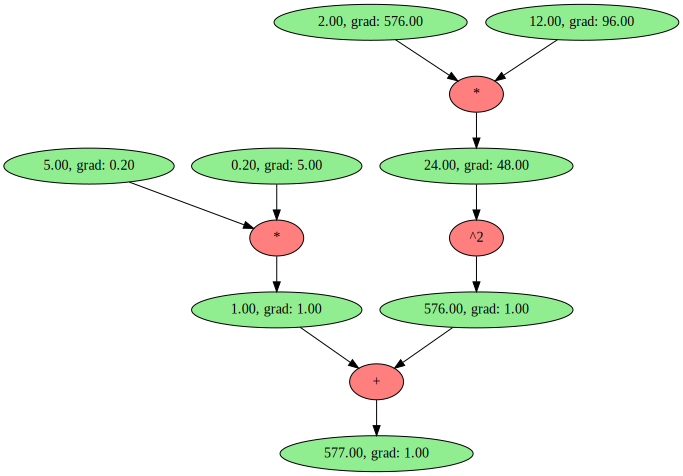

# GradLib

A small-scale [auto-diff](https://en.wikipedia.org/wiki/Automatic_differentiation) library inspired by [Andrej Karpathy's micrograd library](https://github.com/karpathy/micrograd).

Similar to PyTorch's [autograd](https://pytorch.org/blog/overview-of-pytorch-autograd-engine) library, a computational graph (in the form of a DAG) is constructed during the forward pass and is used to calculate gradients during the backward pass. 

## Purpose
This library's goal was meant to serve as an avenue for me to learn how auto-differentiation works and how deep learning frameworks such as PyTorch work under the hood.

As this project is a small side project, the following aren't in the scope of this project:
* Vectorization (i.e. implementation of tensors)
* GPU support
* Forward-mode auto-diff

## Overview

Create a `Scalar` and do some calculations with it:

```python
a = Scalar(1337)
b = Scalar(42)
c = b*a**2
d = c + 10
```
Compute gradients:
```python
d.backward()
```

## Linear Regression?
So far, only a linear regressor model has been implemented. The usage of the linear regression model is as follows:

```python
import numpy as np
from gradlib.models import Regressor
from gradlib.loss import MSE
from gradlib.optim import SGD

X_train = np.arange(0, 100, 1)
y_train = np.arange(0, 100, 1) * 2

sample = np.random.permutation(y_train.shape[0])
X_train = X_train[sample]
y_train = y_train[sample]

lr = 3e-4
epochs = 5000

model = Regressor()
optimizer = SGD(model.parameters, lr=lr)

for t in range(epochs):
  # forward pass
  y_pred = model.forward(X_train)
  loss = MSE(y_train, y_pred)

  # backward pass
  optimizer.zero_grad()
  loss.backward()
  optimizer.step()
  
  print(t+1, loss.value)
```

## Drawing A Computational Graph?
Use the `draw` function from `gradlib.viz` to output a computational graph.
```python
from gradlib.scalar import Scalar
from gradlib.viz import draw

x = Scalar(12)
y = Scalar(5)
z = ((x * 2)**2) + (y/5)
z.backward()

dot = draw(z, show_grad=True)
dot.render('graph')
```
The aforementioned piece of code will produce the following computational graph:
